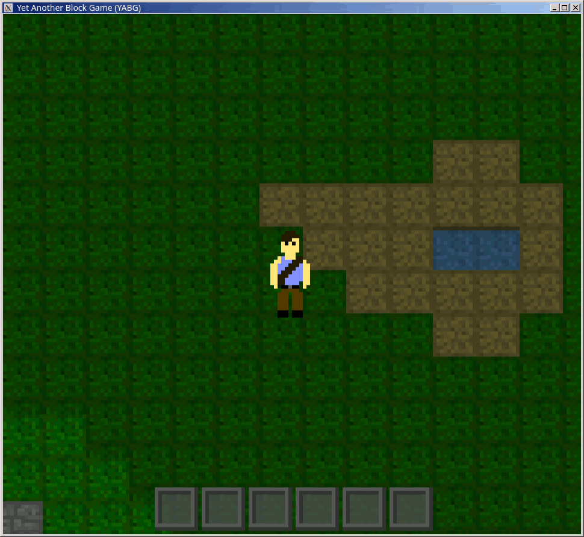

# YABG (Yet Another Block Game)

<p align="center"></p>

## Play instructions:

As of now, the game has no real content, just a procedurally-generated world
that can be walked around, break and place tiles. I've been working on a
large refactor of the engine, and once I deem it "good-nuff", I will work
on adding stuff to do

The following environment variables are currently supported:
```
SCALE_FACTOR <uint> # Scaling factor, changes the size of game pixels relative
                    # to the system's native resolution (default=4)

WINDOW_WIDTH  <uint> # Sets the window width in pixels
WINDOW_HEIGHT <uint> # Sets the window height in pixels

DEBUG_MODE <bool> # Start the game in debug mode (F3 menu)
```

### Controls
```
Keyboard controls:
 W:          Walk up
 A:          Walk left
 S:          Walk down
 D:          Walk right
 , (comma):  Break block
 . (period): Place stone

 ← (left):  Select previous item in hotbar
 → (right): Select next item in hotbar

Gamepad controls:
 Left stick:  Move
 TODO: break, place blocks
```

In the future I will likely make both placing and breaking use the same button
and depend on the item currently highlighted.

## Dependency installation:
```sh
# Zig 0.14 is required, so just install that using zigup or your OS's package
# manager (probably isn't present if you don't use a rolling release)

# Nix:
nix develop # Flake-enabled
nix-shell   # No flake

# Ubuntu/Debian:
libx11-dev libxcursor-dev libxrandr-dev libxinerama-dev libxi-dev libgl-dev

# Alpine:
libx11-dev libxcursor-dev libxrandr-dev libxinerama-dev libxi-dev mesa-gl mesa-dev libc-dev pipewire
```

## Building instructions:
```sh
git clone https://github.com/mgord9518/yabg
cd yabg

zig build # Or `zig build run`
```
